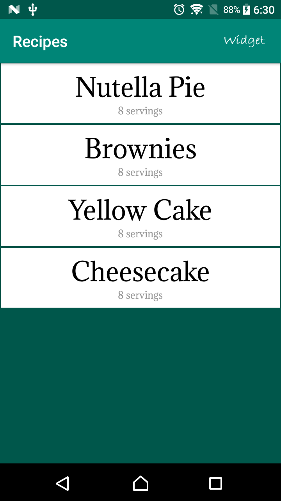
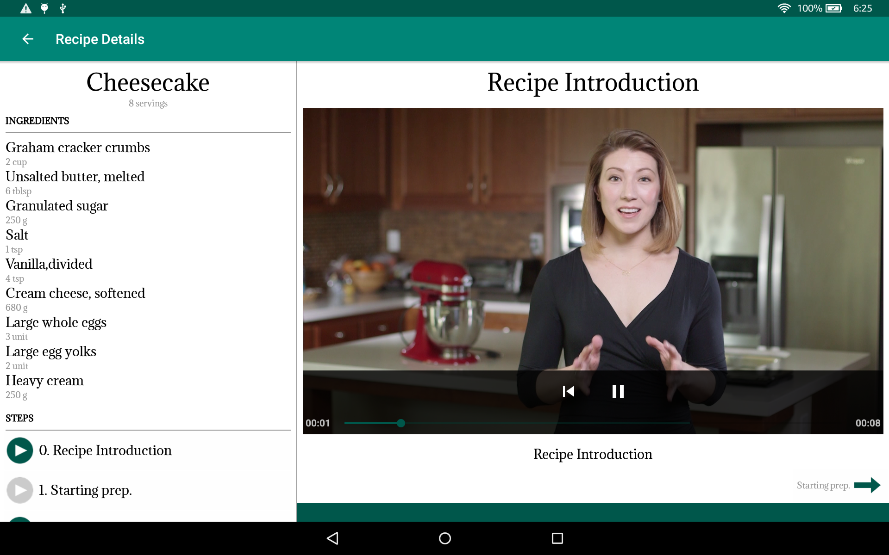
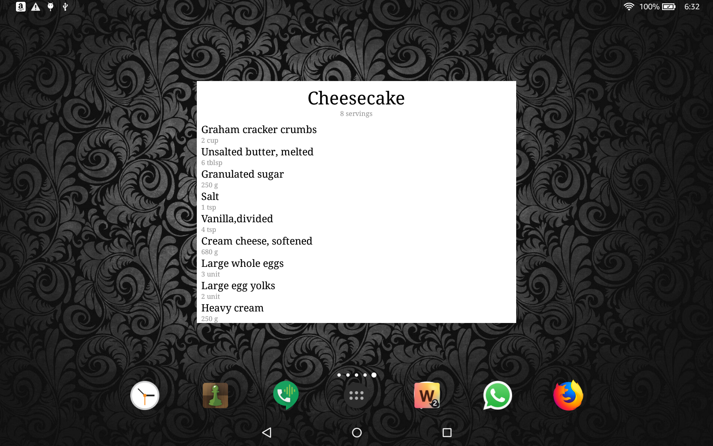

## Baking Recipes

This Android Baking App allows Udacity’s resident baker-in-chief, Miriam, to share her recipes with the world. A user selects a recipe and sees video-guided steps for how to complete it.

The recipe listing JSON file contains the recipes' instructions, ingredients, videos and images needed to complete this project. Not all steps of the recipe have a video. Some may have a video, an image, or no visual media at all.

One of the skills demonstrated in this project is how to handle unexpected input in the data -- professional developers cannot expect polished JSON data when building an app.

### Skills Demonstrated

- Use MediaPlayer/Exoplayer to display videos.
- Handle error cases in Android.
- Add a widget to your app experience.
- Leverage a third-party library in your app.
- Use Fragments to create a responsive design that works on phones and tablets.

#### Introduction on phone in portrait orientation.
#### 

#### Recipe details on a tablet in landscape orientation.

#### 

#### Home screen widget on a tablet in landscape orientation.

#### 
