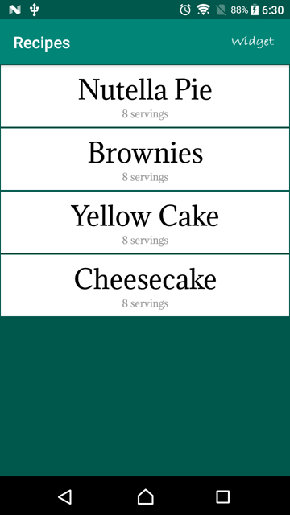

# Baking Recipes

This is an Android app that shares baking recipes with the world, created as part of the [Android Developer Nanodegree by Google](https://www.udacity.com/course/android-developer-nanodegree-by-google--nd801). A user selects a recipe and sees video-guided steps for how to complete it.

### Skills Demonstrated

- JSON parsing from an API endpoint.
- Exoplayer to natively display mp4 videos.
- Home screen widget with a remote grid.
- Leverage of multiple third-party libraries.
- Fragments to create a responsive UI on phones (single-panel) and tablets (two-panel).

#### Introduction grid on 720 x 1280p (API 25) in portrait orientation.

#### Two-pane UI details on 1920 x 1200p (API 22) in landscape orientation.

#### Home screen widget on 1920 x 1200p (API 22) in landscape orientation.

